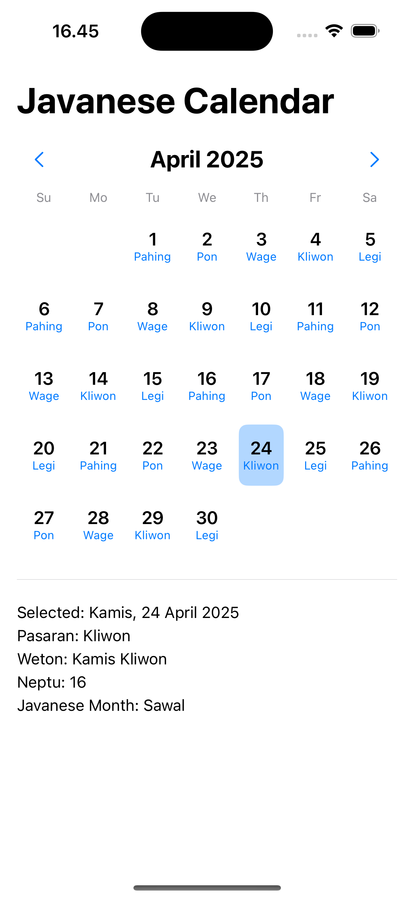

# Javanese Calendar App (Kalender Jawa)

A simple and beautiful SwiftUI app that displays the traditional **Javanese calendar** — including **Weton (Pasaran)** days, **Neptu values**, **Javanese month names**, and supports both **date selection via calendar view** and **localized Indonesian formatting**.

---

## ✨ Features

- 📆 **Full Monthly Calendar View** (tap on dates to select)
- 🔁 **Weton Calculator** – Displays the five-day Pasaran cycle
- 🔢 **Neptu Count** – Combined numeric values from day and Pasaran
- 🌙 **Hijri-based Javanese Month Names** (e.g., Sura, Mulud)
- 🇮🇩 **Fully Localized** in Bahasa Indonesia (days, months, weton)
- 📱 Built entirely with **SwiftUI**

---
